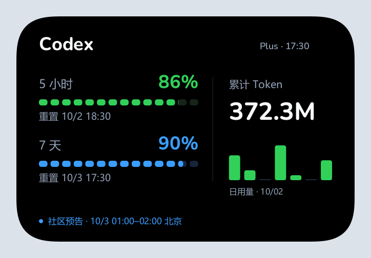

# Codex Quota Mobile

安卓手机直连的 Codex 额度小组件。通过 OpenAI 官网设备授权连接账户，在手机上显示 5 小时／每周剩余额度、重置时间、累计 Token 和每日活动数据。

当前版本：**0.1.3**。Android 8.0（API 26）及以上。



> 上图为布局预览，数字是演示数据，不是任何人的真实账号用量。灰色背景用于展示卡片圆角，不会替换手机壁纸。

## 功能

- 横向 4×2 和紧凑 2×2 桌面小组件，圆润字形与连续圆角。
- 通过官网授权登录，手机直接查询账户；不需要电脑采集器或云中继。
- 分别显示 5 小时／每周剩余百分比和本机时区重置时间。
- 显示官方累计 Token 和接口日期的每日用量，缺字段显示不可用，不编造统计。
- 查询失败时保留最近真实缓存；额度与活动数据分别记录更新时间。
- 可选显示 Tibo 明确的额外重置预告，标注第三方社区来源并提供原文入口。

## 安装与使用

1. 从本仓库 Releases 获取 APK 并安装。
2. 打开「Codex 额度」→「连接官网账户」。
3. 复制设备码并打开官网，登录 OpenAI 账户、确认设备授权，再返回应用。
4. 如官网提示设备码登录未启用，在 ChatGPT「设置 → 安全」开启对应 Codex 设备码登录选项。
5. 长按桌面空白处 → 小组件 → Codex 额度，添加「横向 4×2」或「紧凑 2×2」。
6. 点击组件进入详情；右上角 ↻ 手动刷新。设置中可选择 30 分钟／1 小时／3 小时或关闭后台更新。

更新时直接覆盖安装，不要先卸载。已有横向组件时点 ↻ 更新样式；如果桌面保留了旧竖向占位，移除组件后重新添加即可。
多个账户时，小组件显示账户列表中的第一个账户。

## 数据与隐私

- 累计 Token 来自账户活动数据，不等于订阅剩余额度，也不是 API 账单金额。
- 日用量保留官方接口日期，不把前一天的数据标为今日；未报告的日期不补造数值。
- 登录会话使用 Android Keystore 加密，保存在手机本机私有目录。
- 账号请求发送到 OpenAI；社区公告请求使用独立匿名客户端，不带账号令牌、Cookie 或账户标识。
- 不读取电脑聊天日志、短信、联系人或定位，不上传提示词与回复。
- 默认由 WorkManager 每 30 分钟尝试刷新，联网且电量允许时执行；系统休眠可能延后。
- 没有前台保活、持续 WebSocket 或后台动画。字体随 APK 离线打包。

本应用不是 OpenAI 官方应用。它使用现有 Codex 授权及账户接口，其中额度与活动接口不是承诺长期稳定的公开第三方 API；接口改变时可能需要更新。
第三方社区重置预告不是官方已到账保证。没有明确预告时不预测下一次重置。

## 构建

依赖版本：JDK 21、Android SDK 35、Gradle 8.9、AGP 8.7.3、Kotlin 2.0.21、Glance 1.1.1、Room 2.6.1、WorkManager 2.10.0。
配置自己的 `JAVA_HOME` 与 `ANDROID_HOME`，或用被 Git 忽略的 `local.properties` 指定 SDK。

```sh
./gradlew testDebugUnitTest lintDebug assembleDebug
```

Windows PowerShell：

```powershell
./scripts/build-mobile.ps1
```

脚本也支持 `-GradlePath` 指定已安装的 Gradle。源码中不绑定开发者本机目录。
Release 签名在自己环境中配置以下变量，然后执行 `./scripts/build-mobile.ps1 -Release`：

```text
ANDROID_KEYSTORE_FILE
ANDROID_KEYSTORE_PASSWORD
ANDROID_KEY_ALIAS
ANDROID_KEY_PASSWORD
```

不要提交密钥、密码、`signing.properties` 或账号会话。自行构建的不同签名 APK 无法直接覆盖原发布包。

## 验证

当前版本已有 75 项单元测试通过，lint 无错误，Release 构建与签名验证通过。
小组件不同尺寸、较大字体、空账户和缺数据布局使用同一绘图代码做过电脑预览检查。不同手机字体、桌面排版、系统后台限制和实际耗电仍需设备验证。

## 来源与许可

- 基于 [boudywho/codex-quota-android](https://github.com/boudywho/codex-quota-android) 的 MIT 版本改造，原作者版权与许可保留在 [LICENSE](LICENSE)。
- 横向组件视觉参考 [cyq1017/codex-quota-watch](https://github.com/cyq1017/codex-quota-watch)，Android 绘图独立实现。
- Nunito 字体来自 [Google Fonts / Nunito Project](https://github.com/google/fonts/tree/main/ofl/nunito)，按 SIL Open Font License 1.1 分发；完整许可在 [OFL-Nunito.txt](app/src/main/assets/fonts/OFL-Nunito.txt)。
